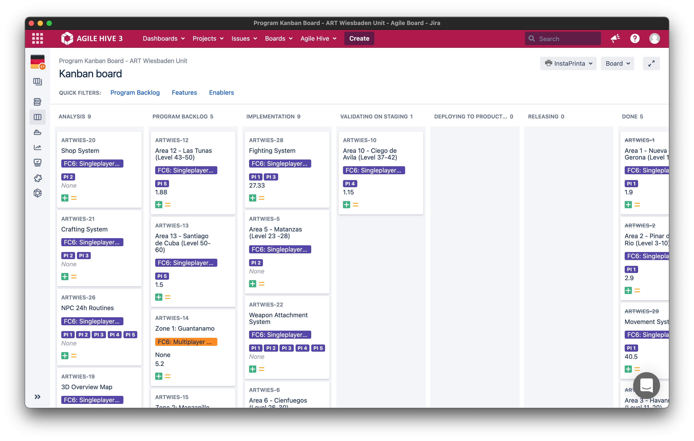

# Desktop App for Jira

This is an app that puts Jira web app in it's own window. Based on Electron and [Nativefier](https://github.com/nativefier/nativefier).

## Screenshot

## Disclaimer

This app is not affiliated, associated, authorized, endorsed by, or in any way officially connected with Atlassian, or any of its subsidiaries or its affiliates.

The names Jira and Atlassian as well as related names, marks, emblems and images are registered trademarks of their respective owners.
